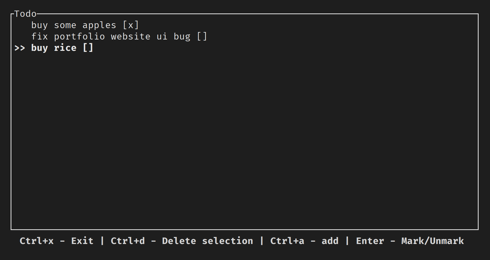

# Todo Tool rs

A user-friendly cli tool to organize your todo, made with Rust, Ratatui, and Sqlite3.<br><br>
This tool is based on my other project made for command line using arguments.<br>
It can be found [here](https://github.com/apollodaniel/todo_rs)

### Preview


#### Run
It can be executed with the following command:
```
todo_tool
```
Or using the cargo utility to run the code on the project folder:
```
cargo run -q --release
```

#### Install
You can also install by executing the following command on project folder:
```
cargo build --release && sudo cp target/release/todo_rs_tui /usr/local/bin/todo_tool && sudo chmod a+x /usr/local/bin/todo_tool
```

### Controls
#### List screen
- <b>Ctrl+x</b> - Exit tool
- <b>Ctrl+d</b> - Delete selection 
- <b>Ctrl+a</b> - add 
- <b>Enter</b> - Mark/Unmark
#### New todo screen
- <b>Ctrl+x</b> - Exit tool
- <b>Esc</b> - Cancel 
- <b>Enter</b> - Save todo


### Data
All data is saved in a sqlite3 database<br>
Database is located on a subfolder called `.todo_rs` located on user Home folder.

On Windows: `C:\Users\<USER>\.todo_rs\todo.db`<br>
On Linux: `/home/<USER>/.todo_rs/todo.db`<br>
On Mac: `/Users/<USER>/.todo_rs/todo.db`

### Dependencies
- [rusqlite](https://crates.io/crates/rusqlite) -  Ergonomic wrapper for SQLite 
- [simple-home-dir](https://crates.io/crates/simple-home-dir) - Retrieve user directory
- [crossterm](https://crates.io/crates/crossterm) -  A crossplatform terminal library for manipulating terminals.
- [ratatui](https://crates.io/crates/ratatui) -  A library that's all about cooking up terminal user interfaces
- [tui-textarea](https://crates.io/crates/tui-textarea) -  tui-textarea is a simple yet powerful text editor widget for ratatui and tui-rs.